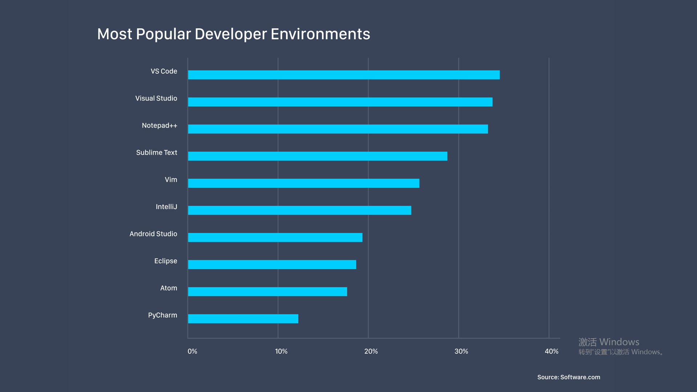
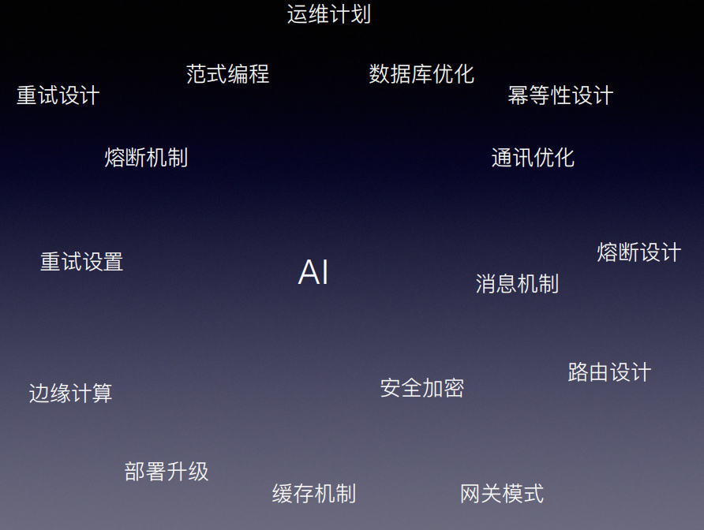

# tutorials-repository
算法学习、工程应用的资源集合  尤其是AI guide或者tutorials

### 深度学习框架以及编程工具
- 深度学习框架
  1. Pytorch (Facebook人工智能研究院，命令式编程)
  2. Mxnet (Amazon，命令式编程+图计算)
  3. Keras (tensorflow高阶api，命令式编程)
  以上框架学习成本较低，有完善且成体系的教程，pytorch广泛用于学术和工业；mxnet和pytorch性能和功能几乎对等，只是比较低调；keras更适用于学生群体。
  不建议使用tensorflow 1.0,如果一定要学习tensorflow，建议使用2.0版本以上。
 - 编程工具
 
    
    如果你90%的业务需求需要python语言，那么pycharm是你需要优先考虑的。
    
### MXNET资源
1. Distributed (Deep) Machine Learning Community —— mxnet发展蓝图
- https://github.com/dmlc
2. 《动手深度学习》 —— 入门mxnet的最好资料
- https://zh.d2l.ai/
3. mxnet gluon —— 问题交流论坛
- https://discuss.gluon.ai/
4. mxnet gluon python api —— mxnet api结构，用于模型调试和问题分析
- http://mxnet.incubator.apache.org/api/python/docs/api/index.html
5. mxnet gluon model zoo Tutorials —— 有哪些可以直接使用的预训练模型
- https://gluon-cv.mxnet.io/tutorials/index.html
6. mxnet gluonNLP model zoo and tutorials —— NLP可调用预训练模型（包括BERT）以及如何自己从0开始构造nlp模型
- https://gluon-nlp.mxnet.io/master/index.html

### Pytorch 资源
1. 中文系统教程 —— 最好最方便入门中文资料
- https://pytorch-cn.readthedocs.io/zh/latest/
2. 英文系统教程 —— 最好最方便入门的英文资料
- https://pytorch.org/docs/stable/index.html

### Keras 资源
1. 中文系统教程 —— 最好最方便入门中文资料
- https://keras.io/zh/

### 深度学习实践和理论
1. 如果你想初步了解深度学习以及python实践，以下是你不错的选择
- 
2. 如果你想进阶深度学习，包括优化策略、loss分析、train/test策略、权重分析、ends-ends等，以下是你不错的选择
- 
3. 如果你想对NLP有一个快速而有系统的认识，以下是你不错的选择
- 
4. 如果你相对深度学习有系统而又全面的认识，以下是你不错的选择
- 
5. 如果你想对CRF理论建立深刻的认识，以下是你不错的选择
- 
6. 如果你想初略看下深度学习应用，例如风格迁移、生成古诗词等，以下是你不错的选择
- [深度有趣](AI tutorial/深度有趣.pdf)
7. 如果你想通过看中文视频学习整个的AI相关理论，例如CNN\RNN\GAN\NLP\RL\AM等，以下是你不错的选择
- [李宏毅-台湾大学-视频](https://www.youtube.com/watch?v=KKT2VkTdFyc)
- [李宏毅-台湾大学-个人网站/pdf/PPT](http://speech.ee.ntu.edu.tw/~tlkagk/talk.html)

### 深度学习 only depend on python?
- 如果是学术科研发文章, maybe depend on python only, (如果有学术大神还请指正)
- 如果是工业生产, maybe 30% depend on python only, what 70% is?
  
  
  

### 数学基础
1. 矩阵、向量运算
- http://zh.gluon.ai/chapter_appendix/math.html
